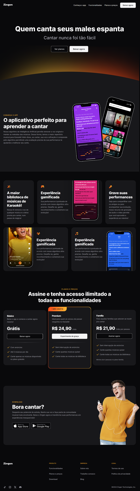

 
<h1 align="center"> Projeto Zingen </h1>

  Atividade prática desenvolvida durante a formação de Desenvolvedor Full-stack da Rocketseat.  
   
  Projeto voltado para prática de HTML, CSS e responsividade, com foco em estruturação visual de uma landing page moderna. 
 

  <a href="#tecnologias">Tecnologias</a>&nbsp;&nbsp;&nbsp;|&nbsp;&nbsp;&nbsp;
  <a href="#projeto">Projeto</a>&nbsp;&nbsp;&nbsp;|&nbsp;&nbsp;&nbsp;
  <a href="#layout">Layout</a>

  

## 🚀 Tecnologias
Esse projeto foi desenvolvido com as seguintes tecnologias:

- HTML
- CSS
- Git e GitHub
- Figma

## 💻 Projeto
O Zingen é uma landing page criada para praticar conceitos de estruturação de conteúdo, estilização com CSS e responsividade. O layout simula uma página institucional moderna com foco em usabilidade.

🔗 [Acesse o projeto online](https://kaiqueccmartins.github.io/projeto-zingen)

## 🔖 Layout
O layout foi criado pelo time de design da Rocketseat para a formação Full-stack. Para visualizar o layout do projeto no Figma é necessário ser aluno e estar logado na conta.

 Feito com ♥ por Kaique Martins durante o curso da Rocketseat 🚀

 
<a href="https://github.com/kaiqueccmartins">Confira meu GitHub</a>
